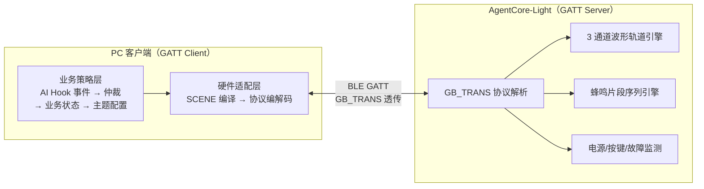
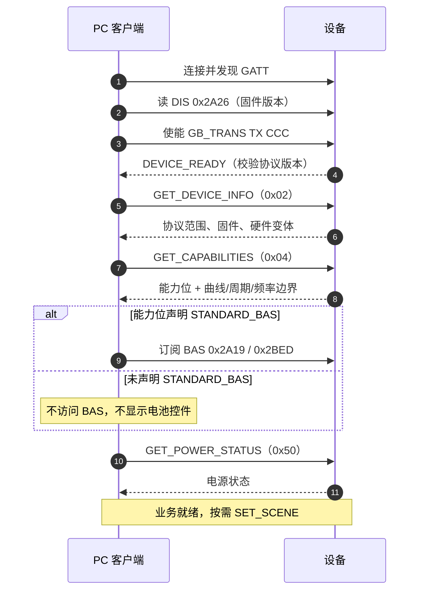
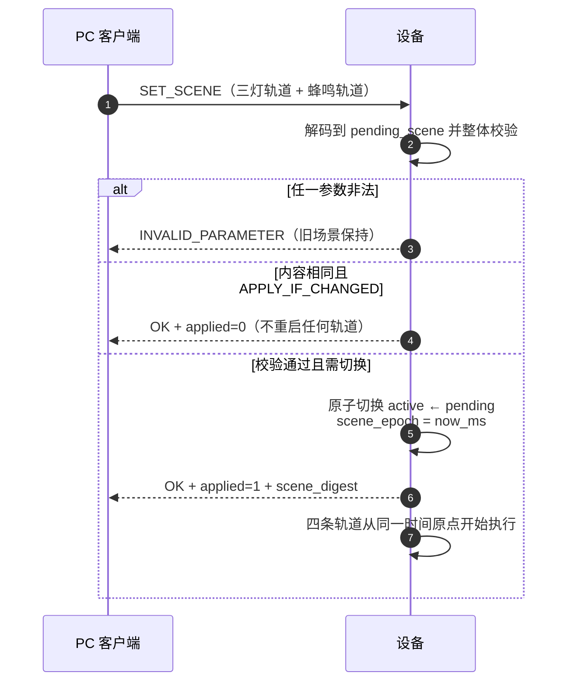
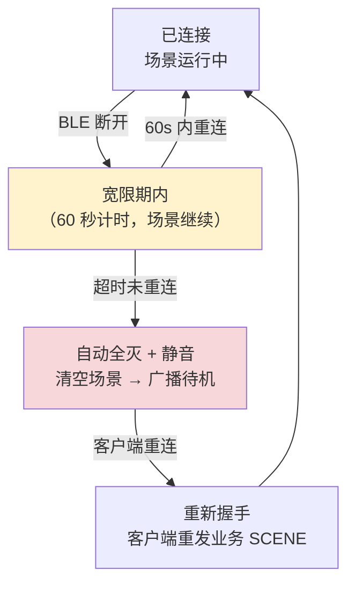

# AgentCore-Light 蓝牙通信协议规范 V0.4

| 项目 | 内容 |
|---|---|
| 文档版本 | V0.4（正式设计版） |
| 线协议版本字节 | `0x04` |
| 文档状态 | 固件实现依据 |
| 适用设备 | AgentCore-Light（`HX_TM_TLSR8208B_A` 模组） |
| 硬件输出 | 3 颗级联可寻址 RGB 灯 + 1 个无源蜂鸣器 |
| 硬件变体 | 有电池版 / 无电池版（同一协议，能力发现区分） |
| 编制日期 | 2026-08-19 |

> **本文是自包含协议规范**：固件工程师阅读本文即可完整实现 V0.4，无需参考其他文档。
> 本文已取代历史版本：UART/GB_TRANS 早期协议、通信协议 V0.2、硬件能力接口 V0.3 Draft 1。**V0.4 不兼容历史版本**（收到非 `0x04` 版本字节一律返回 `VERSION_MISMATCH`）。

---

## 1. 系统模型

### 1.1 角色与架构

```text
┌──────────────────────────┐        ┌─────────────────────────────┐
│  PC 客户端（GATT Client） │        │ AgentCore-Light（GATT Server）│
│                          │        │                             │
│  业务策略层               │        │  物理输出层                  │
│   AI Hook 事件 → 仲裁     │        │   3 通道波形轨道引擎          │
│   → 业务状态 → 主题配置   │        │   蜂鸣片段序列引擎            │
│                          │        │   电源/按键/故障监测          │
│  硬件适配层               │  BLE   │                             │
│   SCENE 编译 → 协议编解码 │ ◄────► │   GB_TRANS 协议解析          │
└──────────────────────────┘        └─────────────────────────────┘
```



**核心原则（机制与策略分离）**：

- 设备**不理解业务语义**。设备不知道 `PROCESSING`、`ERROR` 是什么，只执行物理输出参数：波形、颜色、周期、相位、频率、音量。
- "AI 状态 → 灯效/声音"的映射全部在客户端软件完成。换主题、改颜色、调提示音 = 改客户端配置，**永不升级固件**。
- 设备是**纯执行器**：无业务记忆、无自动衔接、无主动叙事。

### 1.2 统一控制单元：SCENE

所有输出控制收敛为一个命令：**SET_SCENE**。一个 SCENE 完整描述：

```text
OutputScene
├─ 顶部 RGB 灯的完整时间行为（一条波形轨道）
├─ 中间 RGB 灯的完整时间行为（一条波形轨道）
├─ 底部 RGB 灯的完整时间行为（一条波形轨道）
└─ 蜂鸣器的完整时间行为（一条片段序列轨道）
```

规则：

1. **原子生效**：SCENE 整体校验通过后，四者从同一时间原点（`scene_epoch`）同时启动；任一参数非法，全部不改。
2. **整体替换**：新 SCENE 替换旧 SCENE；不存在"只改一颗灯"或"只改蜂鸣器"的业务命令。
3. **设备本地执行**：动画在设备端按参数持续运行，客户端**不需要刷帧**维持动画。
4. **无完成衔接**：有限效果播完自然停止在终态，设备**不会**自动触发下一套效果，也不上报"播完了"事件。
5. **断开宽限期**：BLE 断开后当前 SCENE 继续运行 60 秒（编译期常量），超时未重连则自动停止全部输出。

---

## 2. BLE 链路层

### 2.1 广播

| 项目 | 约定 |
|---|---|
| 角色 | Peripheral / GATT Server |
| 广播类型 | Legacy Connectable Undirected（`ADV_IND`） |
| 广播间隔 | 50 ms |
| 广播名称 | `ACLight-XXXX`（XXXX = 设备地址低 16 位，4 个大写十六进制） |
| Advertising Data | Flags + 16-bit UUID 列表（`0x180A` DIS、`0x180F` BAS 仅电池版）+ 128-bit GB_TRANS UUID |
| Scan Response | Complete Local Name（`0D 09` + 12 字节 ASCII） |

名称仅用于界面展示，**不作为设备类型或能力判断依据**。

### 2.2 GATT 服务表

| 服务 | UUID | 有电池版 | 无电池版 |
|---|---|:---:|:---:|
| Device Information Service | `0x180A` | 必须 | 必须 |
| Battery Service | `0x180F` | 能力可用时 | **不提供** |
| GB_TRANS 透传服务 | 128-bit 自定义 | 必须 | 必须 |

> 无电池版缺少 BAS 是**正常行为**，客户端不得判定为服务发现失败。

GB_TRANS 特征（UUID 以 PC BLE API 常见显示形式给出）：

| 对象 | UUID | 属性 | 方向 |
|---|---|---|---|
| Service | `E7BAA2E6-97AD-E697-A0E7-BABF73657276` | Primary Service | — |
| RX | `E7BAA2E6-97AD-E697-A0E7-BABF72786372` | Write | PC → 设备 |
| TX | `E7BAA2E6-97AD-E697-A0E7-BABF74786372` | Notify（需使能 CCC） | 设备 → PC |

DIS 内容（只读）：

| 特征 | UUID | 内容 |
|---|---|---|
| Firmware Revision String | `0x2A26` | UTF-8 无 `\0`，格式 `<major>.<minor>.<patch>`，如 `1.0.0` |

### 2.3 MTU 与组帧

- 目标 ATT MTU 247；协议数据区上限 **235 字节**（单帧完整长度上限 244 字节）。
- 帧边界**不依赖** GATT Write/Notify 边界：一帧可跨多个 BLE 数据块，一个 BLE 数据块可含多帧。接收端必须缓存组帧（见 §4.6）。
- PC 使能 TX CCC 后，设备应主动发送一次 `DEVICE_READY`（§11.1）。

### 2.4 连接参数

- 连接后请求连接间隔 10 ms、slave latency 99（现有代码行为，最终参数由 PC 端系统栈决定）。
- 固件不得依赖"连接间隔 = 100 次/秒"做时序设计；所有动画推进使用本地毫秒时钟。

---

## 3. 帧格式

### 3.1 帧结构

| 偏移 | 字段 | 长度 | 说明 |
|---:|---|---:|---|
| 0 | 帧头 | 2 | 固定 `0x55 0xAA` |
| 2 | 协议版本 | 1 | 固定 `0x04` |
| 3 | 序列号 | 2 | `u16` 大端，发送方逐帧递增，`0xFFFF` 后回绕 `0x0000` |
| 5 | 命令字 | 1 | 见命令总表 |
| 6 | 数据长度 | 2 | `u16` 大端，**仅数据区**长度，范围 `0~235` |
| 8 | 数据区 | N | 命令专属数据 |
| 8+N | 校验和 | 1 | 帧头至数据区末尾逐字节求和，对 256 取余 |

```text
frame_length = 9 + data_length
```

### 3.2 校验和算法

```c
uint8_t calc_checksum(const uint8_t *p, uint16_t len) {
    uint32_t sum = 0;
    for (uint16_t i = 0; i < len; i++) sum += p[i];
    return (uint8_t)(sum & 0xFF);
}
// len 为帧总长减 1（不含校验和字节本身）
```

### 3.3 字节序与基础类型

- 所有多字节整数**大端序**；
- `u8`/`u16`/`u32`：无符号整数；`bool`：`00`=false、`01`=true；
- 时间单位毫秒（ms）；电压单位毫伏（mV）；
- RGB 分量 `0~255`；亮度、音量 `0~100`（百分比）；
- 相位为归一化整数 `0~65535`，对应 `0~360°`（§7.2.3）；
- 字符串 UTF-8 不带 `\0`；
- **保留字段**：发送方必须填 `0`，接收方忽略。

### 3.4 命令字范围

| 范围 | 用途 |
|---|---|
| `0x01~0x5F` | PC 请求 |
| `0x81~0xDF` | 设备应答，命令字 = 请求命令字 \| `0x80` |
| `0xE0~0xEF` | 设备主动事件 |

### 3.5 超时、重试与幂等

- PC 应答超时建议 `500 ms`；超时最多重发 2 次，**保持原序列号与命令字**；
- 设备以"序列号 + 命令字"识别重复请求，重复请求**只重发缓存应答，不重复执行任何副作用**（不重启场景、不重响蜂鸣、不关机）；
- 帧头错误、长度 > 235、校验失败 → 静默丢弃，不应答；
- 数据区允许出现 `55 AA`，解析器按长度取帧，不得因帧头字节提前截断；
- 半帧缓存超时建议 `500 ms`，超时清空重新搜索帧头。

### 3.6 结果码

| 值 | 名称 | 说明 |
|---:|---|---|
| `0x00` | `OK` | 成功 |
| `0x01` | `INVALID_LENGTH` | 数据长度错误 |
| `0x02` | `INVALID_PARAMETER` | 参数或枚举非法 |
| `0x03` | `UNSUPPORTED_COMMAND` | 命令未定义 |
| `0x04` | `BUSY` | 资源暂时忙 |
| `0x05` | `INVALID_STATE` | 当前状态不允许该操作 |
| `0x06` | `VERSION_MISMATCH` | 协议版本字节不是 `0x04` |
| `0x07` | `NOT_READY` | 外设或通知链路未就绪 |
| `0x08` | Reserved | 历史值，不使用 |
| `0x09` | `LOW_BATTERY` | 低电量保护拒绝执行 |
| `0x0A` | `INTERNAL_ERROR` | 内部异常 |
| `0x0B` | `NOT_SUPPORTED` | 命令已定义但本硬件变体不具备该能力 |

---

## 4. 接收解析流程（固件实现）

1. 每次 BLE Write 收到的字节追加到接收缓存（建议 ≥ 488 字节）；
2. 搜索连续 `0x55 0xAA`；
3. 缓存不足 8 字节 → 等待后续数据；
4. 检查版本字节：非 `0x04` → 丢弃该帧头，继续搜索（历史版本不兼容，D-015）；
5. 读取大端数据长度，> 235 → 丢弃帧头，继续搜索；
6. 缓存不足 `9 + data_length` 字节 → 等待；
7. 校验和验证失败 → 丢弃整帧，不回帧；
8. 校验通过 → 交命令分发层；
9. 从缓存移除完整帧，继续解析下一帧。

---

## 5. 连接握手流程

```text
PC 连接并发现 GATT
  → 读 DIS 0x2A26（固件版本）
  → 使能 GB_TRANS TX CCC
  → 收到 DEVICE_READY（设备主动，校验协议版本）
  → 发 GET_DEVICE_INFO（0x02）
  → 发 GET_CAPABILITIES（0x04）
  → 若能力位声明 STANDARD_BAS：订阅 BAS 0x2A19 / 0x2BED
  → 发 GET_POWER_STATUS（0x50）
  → 业务就绪：按需 SET_SCENE
```



---

## 6. 能力发现

### 6.1 `GET_CAPABILITIES (0x04)` 请求

请求数据：无。

### 6.2 应答（固定结构）

| 偏移 | 字段 | 类型 | 说明 |
|---:|---|---|---|
| 0 | `result` | `u8` | 结果码 |
| 1 | `schema_version` | `u8` | 能力结构版本，V0.4 固定 `1` |
| 2 | `capability_bits` | `u32` | 见 6.3 |
| 6 | `led_count` | `u8` | 固定 `3` |
| 7 | `supported_curves` | `u16` | 曲线位图，Bit N = 1 表示曲线枚举值 N 已实现 |
| 9 | `min_period_ms` | `u16` | 波形最短完整周期 |
| 11 | `max_period_ms` | `u16` | 波形最长完整周期 |
| 13 | `max_transition_ms` | `u16` | 全局过渡时间上限 |
| 15 | `max_buzzer_segments` | `u8` | 蜂鸣片段实际上限（协议绝对上限 16） |
| 16 | `min_frequency_hz` | `u16` | 蜂鸣最低频率 |
| 18 | `max_frequency_hz` | `u16` | 蜂鸣最高频率 |
| 20 | `max_volume` | `u8` | 最大协议音量（通常 100） |
| 21 | `reserved` | `u8[2]` | 固定 0 |

数据区总长 23 字节。

### 6.3 能力位

| Bit | 名称 | 说明 |
|---:|---|---|
| 0 | `RGB_LED` | 存在 RGB 灯 |
| 1 | `PASSIVE_BUZZER` | 存在无源蜂鸣器 |
| 2 | `LED_TRACKS` | 实现 V0.4 轨道场景引擎（SET_SCENE） |
| 3 | `LED_STREAM` | 实现实验性流式帧（§9） |
| 4 | `BATTERY_PRESENT` | 存在主电池 |
| 5 | `BATTERY_ADC` | 电池电压采样可用 |
| 6 | `CHARGE_STATUS` | 充电状态检测可用 |
| 7 | `EXTERNAL_POWER_DETECT` | 外部供电检测可用 |
| 8 | `SOFTWARE_POWER_OFF` | 软件关机/深睡可用 |
| 9 | `STANDARD_BAS` | 提供标准 Battery Service |
| 10 | `BUTTON` | 按键事件可用 |
| 11~31 | Reserved | 必须为 0 |

**能力位铁律**：只有"硬件存在 **且** 当前固件已完整实现"的能力才置位。存在电池 ≠ 电量百分比已标定。`supported_curves` 不得声明 §7.2.2 中标注"不实现"的曲线。

---

## 7. 统一输出模型

### 7.1 概念：波形轨道

每颗灯由一条**波形轨道**驱动。设备每 20 ms 计算一次各灯当前 RGB：

```text
scene_time  = 当前时间 − scene_epoch            （毫秒，u32 回绕安全）
phase_ms    = period_ms × phase / 65536          （相位折算为毫秒）
phase_pos   = (scene_time + phase_ms) % period_ms / period_ms   （0~1，定点小数）
v           = curve(phase_pos)                    （0~1 波形值）
rgb         = lerp(low_rgb, high_rgb, v × brightness)
```

- `curve(t)` 是波形函数，输出归一化值 0~1；
- `low_rgb` / `high_rgb` 是波形的两个颜色端点；
- `brightness` 是整轨亮度系数（0~100 百分比，与波形值相乘后作用于插值结果）；
- `period_ms = 0` 表示静态轨（CONSTANT），不随时间变化；
- 有限次数（`repeat_count > 0`）结束后，轨道固定在 `end_level` 终态，不再变化。

### 7.2 曲线集（curve 枚举）

| 值 | 名称 | 实现 | 公式（t = 0~1 相位位置） |
|---:|---|---|---|
| `0x00` | `CONSTANT` | V0.4 必做 | 恒为 1（输出 `high_rgb × brightness`；`low_rgb`/周期/相位/占空比/次数忽略，必须为 0） |
| `0x01` | `SQUARE` | V0.4 必做 | `t < duty_percent/100 ? 1 : 0` |
| `0x02` | `TRIANGLE` | V0.4 必做 | `t < 0.5 ? 2t : 2−2t` |
| `0x03` | `SAW_UP` | V0.4 必做 | `t` |
| `0x04` | `SAW_DOWN` | V0.4 必做 | `1 − t` |
| `0x05` | `SINE` | **不实现，枚举预留** | 未来定点查表 |

> 整数实现提示：全部曲线可用 16/32 位整数完成。`TRIANGLE` 用移位代替除 2；`SQUARE` 用比较；`SAW` 是线性缩放。**不需要浮点**。

### 7.3 相位（归一化）

- 相位字段 `0~65535` 对应 `0~360°`，与周期长度解耦；
- 常用值：`0x0000`=0°、`0x5555`≈120°、`0xAAAA`≈240°；
- 常用相位差组合：

| 效果 | 三条轨道的相位 |
|---|---|
| 硬跑马（SQUARE + duty 33%） | `0x0000 / 0x5555 / 0xAAAA` |
| 呼吸跑马（TRIANGLE） | `0x0000 / 0x5555 / 0xAAAA` |
| 三灯同相呼吸 | `0x0000 / 0x0000 / 0x0000` |

### 7.4 有限次数与终态（end_level）

- `repeat_count`：波形完整周期数；`0` = 持续运行直到被替换/停止；
- 有限次数结束后输出 `end_level` 终态，**此后轨道不再随时间变化，也不触发任何事件**：

| 值 | 名称 | 行为 |
|---:|---|---|
| `0x00` | `OFF` | 输出黑（0,0,0） |
| `0x01` | `LOW` | 输出 `low_rgb × brightness` |
| `0x02` | `HIGH` | 输出 `high_rgb × brightness` |

> 说明：当 `low_rgb` 为黑时，`OFF` 与 `LOW` 视觉等价——两者都合法，客户端自行选择语义。

### 7.5 蜂鸣轨道

- 无源蜂鸣器由**音调/静音片段序列**驱动；
- `frequency_hz = 0` 表示静音间隔片段（输出关闭，持续 `duration_ms`）；
- `segment_count = 0` 表示本 SCENE 静音（无蜂鸣行为）；
- `repeat_count = 0`：整段序列持续循环，直到被替换/停止；
- `repeat_count > 0`：整段序列循环 N 次后停止输出；
- 全部片段在开始前完成校验；频率必须在能力范围 `[min_frequency_hz, max_frequency_hz]` 内；
- 音量通过 PWM 占空比近似，不保证声压线性。
- `volume = 0` 表示静音；当 `frequency_hz = 0` 时 `volume` 被忽略，推荐写 0。

---

## 8. SET_SCENE（0x20）

### 8.1 请求布局

数据区总长 59 + 5×N 字节（N = 蜂鸣片段数，0 ≤ N ≤ 16）：

| 偏移 | 字段 | 类型 | 说明 |
|---:|---|---|---|
| 0 | `format_version` | `u8` | 固定 `1` |
| 1 | `scene_kind` | `u8` | 固定 `0x01`（TRACKS；其他值返回 `INVALID_PARAMETER`） |
| 2 | `apply_mode` | `u8` | 见 8.4 |
| 3 | `transition_ms` | `u16` | 全局进入过渡（见 8.3）；`0` = 立即切换 |
| 5 | `reserved` | `u8` | 固定 0 |
| 6 | `led_track[0]` | 16B | 顶部灯（灯序号 0） |
| 22 | `led_track[1]` | 16B | 中间灯（灯序号 1） |
| 38 | `led_track[2]` | 16B | 底部灯（灯序号 2） |
| 54 | `buzzer_track` | 5+5N B | 蜂鸣轨道 |

#### LedTrack（16 字节）

| 相对偏移 | 字段 | 类型 | 说明 |
|---:|---|---|---|
| 0 | `curve` | `u8` | 曲线枚举（§7.2） |
| 1 | `low_r` / `low_g` / `low_b` | `u8×3` | 波形低点颜色 |
| 4 | `high_r` / `high_g` / `high_b` | `u8×3` | 波形高点颜色 |
| 7 | `brightness` | `u8` | `0~100`；`0` = 全黑，轨道时间仍正常推进 |
| 8 | `period_ms` | `u16` | 完整周期；`0` = CONSTANT 静态 |
| 10 | `phase` | `u16` | 归一化相位 `0~65535` |
| 12 | `duty_percent` | `u8` | 仅 SQUARE 有效，`1~99` |
| 13 | `repeat_count` | `u16` | `0` = 持续 |
| 15 | `end_level` | `u8` | `0x00` OFF / `0x01` LOW / `0x02` HIGH |

#### BuzzerTrack

| 相对偏移 | 字段 | 类型 | 说明 |
|---:|---|---|---|
| 0 | `start_delay_ms` | `u16` | 从 scene_epoch 起延迟起播；`0` = 立即 |
| 2 | `repeat_count` | `u16` | `0` = 持续循环 |
| 4 | `segment_count` | `u8` | `0` = 静音；`1~16` |
| 5 | `segments[]` | 5B×N | 片段数组 |

#### Segment（5 字节）

| 相对偏移 | 字段 | 类型 | 说明 |
|---:|---|---|---|
| 0 | `frequency_hz` | `u16` | `0` = 静音间隔；否则在能力范围内 |
| 2 | `duration_ms` | `u16` | 必须 > 0 |
| 4 | `volume` | `u8` | `0~100`；`0` = 静音 |

### 8.2 校验规则（先整体校验，后原子生效）

| 规则 | 违规返回 |
|---|---|
| `format_version == 1`、`scene_kind == 0x01`、`reserved == 0` | `INVALID_PARAMETER` |
| 数据区长度 == `59 + 5 × segment_count` | `INVALID_LENGTH` |
| `curve` 在 `supported_curves` 位图内 | `INVALID_PARAMETER` |
| `brightness` 在 `0~100` | `INVALID_PARAMETER` |
| `period_ms` 为 0 或在 `[min_period_ms, max_period_ms]` | `INVALID_PARAMETER` |
| CONSTANT 时：`period/phase/duty/repeat` 必须为 0，`end_level` 任意 | `INVALID_PARAMETER` |
| 非 SQUARE 时：`duty_percent` 必须为 0 | `INVALID_PARAMETER` |
| SQUARE 时：`duty_percent` 在 `1~99` | `INVALID_PARAMETER` |
| `end_level` ≤ `0x02` | `INVALID_PARAMETER` |
| `transition_ms` ≤ `max_transition_ms` | `INVALID_PARAMETER` |
| 蜂鸣频率为 0 或在 `[min_frequency_hz, max_frequency_hz]` | `INVALID_PARAMETER` |
| `segment_count` ≤ `max_buzzer_segments`（且 ≤ 16） | `INVALID_PARAMETER` |
| 低电量保护生效（见 §10.4） | `LOW_BATTERY` |

**任一条违规：返回错误，三灯与蜂鸣器全部保持原状。**

### 8.3 全局过渡 transition_ms

- `transition_ms = 0`：新 SCENE 立即生效；
- `transition_ms > 0`：切换时，每颗灯的实际输出从"切换瞬间的当前 RGB"向"新轨道计算的 RGB"线性过渡，时长 `transition_ms`；过渡期间动态轨道的波形值按"当前值 → 目标值"插值，过渡结束后完全交给轨道函数；
- 蜂鸣器不受 transition_ms 影响，按自身 `start_delay_ms` 起播。

### 8.4 apply_mode（重播语义）

| 值 | 名称 | 行为 |
|---:|---|---|
| `0x00` | `APPLY_IF_CHANGED` | 内容与当前有效 SCENE 相同 → 返回 `OK` 且 `applied=0`，**不重启任何轨道**；不同 → 原子切换，全部轨道从新 `scene_epoch` 启动 |
| `0x01` | `RESTART_SCENE` | 内容相同也整体重启：三灯 + 蜂鸣从新 `scene_epoch` 一起重新开始 |
| `0x02` | `RESTORE_SCENE` | **不实现，枚举预留**。收到返回 `INVALID_PARAMETER` |

**内容比较规则（幂等判定）**：

- 比较范围：`format_version`、`scene_kind`、`transition_ms`、`reserved`、三条 LedTrack、BuzzerTrack；
- **不比较** `apply_mode`；
- 全部保留字节已强制为 0，因此"语义相同"与"字节相同"等价，直接逐字节比较即可；
- 设备需保存当前有效 SCENE 的规范化副本（59+5N 字节，N ≤ 16 时最大 139 字节）用于比较。

**触发来源 → 行为的完整矩阵**：

| 情况 | 推荐行为 |
|---|---|
| 协议重试（同序列号+命令字） | 只重发缓存应答（§3.5），与 apply_mode 无关 |
| 重复业务事件产生相同 SCENE | 客户端默认发 `APPLY_IF_CHANGED` → 不重播 |
| 业务状态离开后再次进入 | 客户端可发 `RESTART_SCENE` 重播提示音 |
| 断线重连后同步当前状态 | 客户端发 `APPLY_IF_CHANGED` → 静默对齐 |
| 用户主动"试听/重播" | 客户端发 `RESTART_SCENE` |

### 8.5 应答

| 偏移 | 字段 | 类型 | 说明 |
|---:|---|---|---|
| 0 | `result` | `u8` | 结果码 |
| 1 | `applied` | `bool` | `01` = 场景已生效/已重启；`00` = 内容相同未重启（仅 `APPLY_IF_CHANGED` 可能出现） |
| 2 | `scene_digest` | `u16` | 当前有效场景的摘要（见下） |

`scene_digest`：规范化场景数据（apply_mode 字节视为 0）逐字节求和取低 16 位。用于 `GET_OUTPUT_STATUS` 关联与客户端去重，非安全校验。

### 8.6 执行要求



实现步骤：

1. 解码到 `pending_scene` 缓冲；
2. 整体校验；
3. 与当前场景比较（按 apply_mode 规则）；
4. 原子切换：`active_scene ↔ pending_scene`，更新 `scene_epoch = now_ms`；
5. 灯轨道与蜂鸣轨道从同一 `scene_epoch` 推进；
6. 全部执行非阻塞，不得影响 BLE 主循环；
7. `CONSTANT` 且输出未变的轨道跳过物理刷新（省电、减少 WS2812 发送次数）。

---

## 9. 实验性流式帧 LED_STREAM_FRAME（0x22）

仅能力位 `LED_STREAM` 置位时实现。用途：编辑器实时预览、诊断、实验。**不进入业务主链路**。

请求数据（13 字节）：

| 偏移 | 字段 | 类型 | 说明 |
|---:|---|---|---|
| 0 | `brightness` | `u8` | `0~100` |
| 1 | `transition_ms` | `u16` | 设备端本地插值过渡 |
| 3 | `pixels` | `u8[9]` | 三灯目标 RGB（顶/中/底） |
| 12 | `reserved` | `u8` | 固定 0 |

规则：

- **latest-frame-wins**：只保留最新目标帧，帧积压时覆盖未发送的中间目标，**禁止排队补播过期画面**；
- 设备仍以 20 ms 步长本地插值；
- 该命令不携带蜂鸣器内容，不影响当前 SCENE 的蜂鸣轨道；
- 当前有活动 SCENE 时收到流式帧：直接替换三灯输出（灯轨道临时脱离 SCENE 计算），下一次 SET_SCENE 恢复轨道引擎；
- 收到流式帧时不清除当前 SCENE 记录（用于幂等比较与状态查询）。

---

## 10. 电源接口

### 10.1 `GET_POWER_STATUS (0x50)`

请求数据：无。**两种硬件变体都必须支持本命令**（无电池版返回哨兵值，见 10.2）。

应答：

| 偏移 | 字段 | 类型 | 说明 |
|---:|---|---|---|
| 0 | `result` | `u8` | 结果码 |
| 1 | `power_source` | `u8` | `0x00` UNKNOWN / `0x01` EXTERNAL / `0x02` BATTERY / `0x03` EXTERNAL_AND_BATTERY |
| 2 | `power_flags` | `u16` | 见下 |
| 4 | `battery_mv` | `u16` | 不支持或未知时 `0xFFFF` |
| 6 | `battery_percent` | `u8` | `0~100`；尚未标定时 `0xFF` |
| 7 | `charge_state` | `u8` | 见下 |

`power_flags` 位：

| Bit | 说明 |
|---:|---|
| 0 | Battery present |
| 1 | External power present |
| 2 | Charging |
| 3 | Full |
| 4 | Low battery |
| 5 | Critical battery |
| 6 | Software power-off available |
| 7~15 | Reserved |

`charge_state`：`0x00` NOT_SUPPORTED / `0x01` UNKNOWN / `0x02` NOT_CHARGING / `0x03` CHARGING / `0x04` FULL / `0x05` FAULT。

### 10.2 变体返回规范

| 字段 | 有电池版 | 无电池版 |
|---|---|---|
| `power_source` | BATTERY 或 EXTERNAL_AND_BATTERY | EXTERNAL |
| Battery present | 1 | 0 |
| External power present | 实测 | 固定 1（设备能运行即说明有外部电源） |
| `battery_mv` | 实测或 `0xFFFF` | `0xFFFF` |
| `battery_percent` | 实测或 `0xFF` | `0xFF` |
| `charge_state` | UNKNOWN/NOT_CHARGING/CHARGING/FULL/FAULT | NOT_SUPPORTED |
| BAS | 能力声明时存在 | 不存在 |
| POWER_OFF | 能力声明时支持 | 返回 `NOT_SUPPORTED` |

### 10.3 `POWER_OFF (0x51)`

请求数据：无。仅 `SOFTWARE_POWER_OFF` 能力置位时允许调用。

- 先返回 `OK` 应答，确认 TX Notify 已提交后再关灯、停蜂鸣、进关机/深睡；
- 建议应答发送到实际断电之间保留约 200 ms；
- 无电池版返回 `NOT_SUPPORTED`，不得伪装成"低功耗休眠"。

### 10.4 低电量保护

- 低电量保护生效时：拒绝高耗电输出（灯效、蜂鸣），`SET_SCENE` 返回 `LOW_BATTERY`；
- 保护阈值在固件内标定（编译期常量），不在协议中配置；
- 电量/充电状态变化时通过 `POWER_CHANGED` 事件上报（§11.2）。

---

## 11. 主动事件

设备主动事件使用设备自身发送序列号，PC 不应答。

### 11.1 `DEVICE_READY (0xE0)`

PC 使能 TX CCC 后，设备主动发送一次（也用于每次连接建立后的协议自检）。

| 偏移 | 字段 | 类型 | 说明 |
|---:|---|---|---|
| 0 | `protocol_version` | `u8` | 固定 `0x04` |
| 1 | `fw_major` | `u8` | 固件主版本 |
| 2 | `fw_minor` | `u8` | 固件次版本 |
| 3 | `fw_patch` | `u8` | 固件修订版本 |
| 4 | `hardware_variant` | `u8` | `0x00` UNKNOWN / `0x01` BATTERY / `0x02` EXTERNAL_POWER_ONLY |
| 5 | `boot_reason` | `u8` | `0` 未知 / `1` 上电 / `2` 按键唤醒 / `3` 软件复位 / `4` 看门狗复位 |

> 三段固件版本必须与 DIS `0x2A26`、`GET_DEVICE_INFO` 应答完全一致——**单一数据源**，禁止分别维护常量。

### 11.2 `POWER_CHANGED (0xE2)`

电源状态变化时上报（电量、充电状态、外部供电变化）。数据区与 `GET_POWER_STATUS` 应答偏移 1~7 相同（不含 result）：

```text
power_source(u8) + power_flags(u16) + battery_mv(u16) + battery_percent(u8) + charge_state(u8)
```

### 11.3 `BUTTON_EVENT (0xE3)`

仅 `BUTTON` 能力置位时上报。`event(u8) + duration_ms(u16)`：

| event | 含义 |
|---:|---|
| `0x01` | 短按 |
| `0x02` | 长按 |
| `0x03` | 超长按 |

按键事件**只上报，不触发本地输出**（设备无自主行为）。

### 11.4 `FAULT_EVENT (0xEF)`

`fault_source(u8) + fault_code(u8) + context(u16)`：

| fault_source | 含义 |
|---:|---|
| `0x01` | LED |
| `0x02` | 蜂鸣器 |
| `0x03` | 电源 |
| `0x04` | 协议内部 |

---

## 12. 系统命令

### 12.1 `PING (0x01)`

请求数据：无。应答：`result(u8) + uptime_s(u32)`（本次开机运行秒数）。

### 12.2 `GET_DEVICE_INFO (0x02)`

请求数据：无。

应答：

| 偏移 | 字段 | 类型 | 说明 |
|---:|---|---|---|
| 0 | `result` | `u8` | 结果码 |
| 1 | `protocol_min` | `u8` | 支持最低线协议版本，V0.4 为 `0x04` |
| 2 | `protocol_max` | `u8` | 支持最高线协议版本，V0.4 为 `0x04` |
| 3 | `fw_major` | `u8` | 固件主版本 |
| 4 | `fw_minor` | `u8` | 固件次版本 |
| 5 | `fw_patch` | `u8` | 固件修订版本 |
| 6 | `hardware_revision` | `u8` | 主板硬件版本 |
| 7 | `hardware_variant` | `u8` | 见 11.1 |
| 8 | `product_id` | `u16` | `0x0001` = AgentCore-Light 产品族 |
| 10 | `device_id` | `u8[6]` | BLE 地址正常显示顺序（AA:BB:CC:DD:EE:FF → AA BB CC DD EE FF） |

### 12.3 `GET_RUNTIME_STATUS (0x03)`

请求数据：无。

应答：

| 偏移 | 字段 | 类型 | 说明 |
|---:|---|---|---|
| 0 | `result` | `u8` | 结果码 |
| 1 | `device_state` | `u8` | `0x00` BOOTING / `0x01` ADVERTISING / `0x02` CONNECTED / `0x03` SHUTTING_DOWN / `0x04` FAULT |
| 2 | `runtime_flags` | `u16` | 见下 |
| 4 | `active_scene_digest` | `u16` | 当前有效场景摘要；无场景为 0 |
| 6 | `scene_uptime_ms` | `u32` | 当前场景已运行毫秒数；无场景为 0 |
| 10 | `fault_flags` | `u16` | 见下 |

`runtime_flags` 位：

| Bit | 说明 |
|---:|---|
| 0 | LED 活动 |
| 1 | 蜂鸣活动 |
| 2 | 低电量保护生效 |
| 3 | Reserved（恒 0） |
| 4 | 外部电源在位 |
| 5 | 电池在位 |
| 6 | 故障激活 |
| 7~15 | Reserved |

`fault_flags` 位：Bit 0 LED、Bit 1 蜂鸣器、Bit 2 电源、Bit 3 Reserved（恒 0）、Bit 4 协议内部错误；其余 Reserved。

### 12.4 `RESET_OUTPUTS (0x05)`

请求数据：无。**原子完成**：

1. 停止三颗灯所有动态输出；
2. 熄灭三颗灯；
3. 立即停止蜂鸣器；
4. 清空当前有效 SCENE（`active_scene_digest = 0`）；
5. 返回 `OK`。

任何动画阶段均可调用。重复调用同样返回 `OK`。

### 12.5 `GET_OUTPUT_STATUS (0x21)`

仅用于状态展示与诊断，不参与业务状态推进。

请求数据：无。

应答：

| 偏移 | 字段 | 类型 | 说明 |
|---:|---|---|---|
| 0 | `result` | `u8` | 结果码 |
| 1 | `scene_digest` | `u16` | 当前有效场景摘要；无场景为 0 |
| 3 | `scene_state` | `u8` | `0x00` NONE / `0x01` RUNNING / `0x02` FINISHED（有限效果已结束停在终态）/ `0x03` FAULT |
| 4 | `led0_rgb` | `u8[3]` | 顶部灯当前实际 RGB |
| 7 | `led1_rgb` | `u8[3]` | 中间灯当前实际 RGB |
| 10 | `led2_rgb` | `u8[3]` | 底部灯当前实际 RGB |
| 13 | `buzzer_state` | `u8` | `0x00` IDLE / `0x01` PLAYING |
| 14 | `buzzer_frequency_hz` | `u16` | 当前发声频率；静音片段为 0 |
| 16 | `buzzer_volume` | `u8` | 经设备上限钳制后的实际音量 |
| 17 | `scene_uptime_ms` | `u32` | 自 scene_epoch 起经过毫秒数 |

> 返回的是**设备实际执行结果**，不是客户端最后发送参数的简单回显。

---

## 13. BLE 断连宽限期

| 项目 | 行为 |
|---|---|
| 断开瞬间 | 当前 SCENE **继续运行** |
| 断开后 60 秒内重连 | 无感恢复；客户端重发当前业务 SCENE（`APPLY_IF_CHANGED`，幂等对齐） |
| 断开超 60 秒 | 设备自动停止全部输出（等价于内部执行 RESET_OUTPUTS），进入广播待机 |
| 宽限期时长 | **60 秒，编译期常量**，不在协议中配置 |



设备不记忆跨连接的业务状态；重连后一切由客户端重新下发。

---

## 14. 固件实现指南

### 14.1 最小状态集

```c
typedef struct {
    uint8_t  curve;
    uint8_t  low_rgb[3];
    uint8_t  high_rgb[3];
    uint8_t  brightness;
    uint16_t period_ms;
    uint16_t phase;
    uint8_t  duty_percent;
    uint16_t repeat_count;
    uint8_t  end_level;
} led_track_t;                                    // 16 字节

typedef struct {
    uint16_t freq_hz;
    uint16_t duration_ms;
    uint8_t  volume;
} buzzer_segment_t;                                // 5 字节

typedef struct {
    uint8_t   apply_mode;                          // 仅用于本次请求
    uint16_t  transition_ms;
    led_track_t leds[3];
    uint16_t start_delay_ms;
    uint16_t repeat_count;
    uint8_t  segment_count;
    buzzer_segment_t segments[16];
} output_scene_t;

// 运行时状态
output_scene_t pending_scene, active_scene;
uint32_t scene_epoch_ms;
uint16_t scene_digest;
uint8_t  device_state;
```

### 14.2 渲染循环（每 20 ms）

```c
void scene_tick(void) {
    if (device_state != CONNECTED_OR_GRACE) return;
    uint32_t t = now_ms() - scene_epoch_ms;
    for (int i = 0; i < 3; i++) {
        led_track_t *tr = &active_scene.leds[i];
        uint8_t rgb[3];
        if (tr->curve == CURVE_CONSTANT) {
            rgb = scale(tr->high_rgb, tr->brightness);
        } else {
            uint32_t period = tr->period_ms;
            uint32_t phase_ms = (uint32_t)(((uint64_t)period * tr->phase) >> 16);
            uint32_t pos = (t + phase_ms) % period;
            // 有限次数：已结束 → 终态
            uint32_t cycles_done = (t + phase_ms) / period;
            if (tr->repeat_count && cycles_done >= tr->repeat_count) {
                rgb = end_level_rgb(tr);            // OFF/LOW/HIGH
            } else {
                uint16_t v = curve_value(tr, pos, period);   // 0..1024 定点
                rgb = lerp2(tr->low_rgb, tr->high_rgb, v, tr->brightness);
            }
        }
        led_set_target(i, rgb);                    // 内部处理 transition_ms 插值
    }
    buzzer_tick(t);                                // 独立推进片段索引，同一时间基准
}
```

要点：

- `curve_value` 输出 0~1024 定点值，`lerp2` 用整数乘加；
- 输出未变化的灯跳过 WS2812 物理刷新；
- WS2812 发送期间仅数据段（3 灯 72 bit ≈ 88~90 μs）关中断，锁存等待恢复中断（现有实现已满足）；
- 蜂鸣器为非阻塞 PWM 任务；
- **DEBUG 日志必须可编译关闭**；性能验收分别测开关两种构建。

### 14.3 双缓冲与原子切换

1. 接收完整帧 → 解码到 `pending_scene`；
2. 整体校验（§8.2 全表）；
3. 幂等比较（§8.4，`APPLY_IF_CHANGED` 且内容相同 → 应答 `applied=0`，不动 `active_scene`）；
4. 切换：拷贝 `pending_scene → active_scene`，`scene_epoch_ms = now_ms()`，重算 `scene_digest`；
5. 应答 `applied=1 + scene_digest`。

### 14.4 断连宽限期实现

- 连接断开 → 启动 60 秒计时器，场景继续 tick；
- 60 秒内重连 → 取消计时器（场景继续，等待客户端对齐）；
- 超时 → 执行 RESET_OUTPUTS 等价操作（全灭、静音、清场景），进入广播。

### 14.5 低电量保护

- 电量低于保护阈值（固件标定常量）→ 拒绝 `SET_SCENE`（`LOW_BATTERY`），已运行的高耗电输出停止；
- 恢复后客户端重发 SCENE 即可。

---

## 15. 客户端实现指南

1. 连接 → 读 DIS → 使能 TX CCC → 等 `DEVICE_READY` → `GET_DEVICE_INFO` → `GET_CAPABILITIES` → 按能力位决定 BAS 订阅与 UI；
2. 业务链路：`Hook 事件 → 会话仲裁 → 业务状态 → 主题配置编译为 OutputScene → 与当前有效 SCENE 规范化去重 → SET_SCENE`；
3. 重复业务事件 → 发 `APPLY_IF_CHANGED`（内容去重后通常直接不发）；
4. 试听/重播/再次告警 → `RESTART_SCENE`；
5. 断线重连 → 重发当前业务 SCENE（`APPLY_IF_CHANGED`）+ `GET_OUTPUT_STATUS` 对账；
6. **单 writer 发送队列**：同一时刻只允许一个完整协议事务在途（业务命令不得与分片写入交错）；
7. 发现设备协议版本不支持 → 提示升级，不做协议回退（V0.4 无兼容模式）。

---

## 16. 命令总表

| 命令字 | 名称 | 方向 | 能力要求 |
|---:|---|---|---|
| `0x01` | PING | PC→设备 | 必须 |
| `0x02` | GET_DEVICE_INFO | PC→设备 | 必须 |
| `0x03` | GET_RUNTIME_STATUS | PC→设备 | 必须 |
| `0x04` | GET_CAPABILITIES | PC→设备 | 必须 |
| `0x05` | RESET_OUTPUTS | PC→设备 | 必须 |
| `0x20` | SET_SCENE | PC→设备 | `LED_TRACKS` |
| `0x21` | GET_OUTPUT_STATUS | PC→设备 | `LED_TRACKS` |
| `0x22` | LED_STREAM_FRAME | PC→设备 | `LED_STREAM`（实验性） |
| `0x50` | GET_POWER_STATUS | PC→设备 | 必须 |
| `0x51` | POWER_OFF | PC→设备 | `SOFTWARE_POWER_OFF` |
| `0xE0` | DEVICE_READY | 设备→PC | 必须 |
| `0xE2` | POWER_CHANGED | 设备→PC | 电源变化能力 |
| `0xE3` | BUTTON_EVENT | 设备→PC | `BUTTON` |
| `0xEF` | FAULT_EVENT | 设备→PC | 必须 |

应答命令字 = 请求命令字 | `0x80`。

---

## 17. 帧示例（全部经脚本生成并验证）

### 17.1 全灭场景（NONE）— SET_SCENE，59 字节数据区

三灯 CONSTANT 黑、蜂鸣静音、立即切换：

```text
55 AA 04 00 01 20 00 3B 01 01 00 00 00 00 00 00 00 00 00 00 00 00 00 00
00 00 00 00 00 00 00 00 00 00 00 00 00 00 00 00 00 00 00 00 00 00 00 00
00 00 00 00 00 00 00 00 00 00 00 00 00 00 00 00 00 00 00 61
```

### 17.2 处理中：中间黄灯常亮（PROCESSING）

中间灯 CONSTANT、高点 `FF B4 00`、亮度 50：

```text
55 AA 04 00 02 20 00 3B 01 01 00 00 00 00 00 00 00 00 00 00 00 00 00 00
00 00 00 00 00 00 00 00 00 00 FF B4 00 32 00 00 00 00 00 00 00 00 00 00
00 00 00 00 00 00 00 00 00 00 00 00 00 00 00 00 00 00 00 47
```

### 17.3 错误：红灯闪烁 5 次 + 蜂鸣三连响（ERROR），69 字节数据区

顶灯 SQUARE、红 `FF 00 00`、周期 400 ms、占空比 50%、重复 5 次后灭；蜂鸣 2000 Hz 响 150 ms / 静音 150 ms、重复 3 次：

```text
55 AA 04 00 03 20 00 45 01 01 00 00 00 00 01 00 00 00 FF 00 00 3C 01 90
00 00 32 00 05 00 00 00 00 00 00 00 00 00 00 00 00 00 00 00 00 00 00 00
00 00 00 00 00 00 00 00 00 00 00 00 00 00 00 00 00 03 02 07 D0 00 96 32
00 00 00 96 00 AB
```

### 17.4 呼吸跑马（生成中）

三灯同 TRIANGLE、绿端点 `00 FF 00`、周期 1200 ms、相位 0°/120°/240°（`0000/5555/AAAA`）、持续：

```text
55 AA 04 00 04 20 00 3B 01 01 00 00 00 00 02 00 00 00 00 FF 00 32 04 B0
00 00 00 00 00 00 02 00 00 00 00 FF 00 32 04 B0 55 55 00 00 00 00 02 00
00 00 00 FF 00 32 04 B0 AA AA 00 00 00 00 00 00 00 00 00 17
```

### 17.5 RESET_OUTPUTS

```text
55 AA 04 00 01 05 00 00 09
```

### 17.6 PING 请求与应答（uptime = 3600 秒）

```text
请求：55 AA 04 00 01 01 00 00 05
应答：55 AA 04 00 01 81 00 05 00 00 00 0E 10 A8
```

### 17.7 GET_CAPABILITIES 请求与应答

全功能有电池版（能力位 `0x000007FF` = Bit 0~10 全置位，曲线 0~4，周期 200~5000 ms，过渡上限 2500 ms，16 片段，频率 100~10000 Hz）：

```text
请求：55 AA 04 00 01 04 00 00 08
应答：55 AA 04 00 01 84 00 17 00 01 00 00 07 FF 03 00 1F 00 C8 13 88 09 C4 10
00 64 27 10 64 00 00 07
```

### 17.8 SET_SCENE 应答（applied=1，digest=0x01E7）

```text
55 AA 04 00 02 A0 00 03 01 01 E7 91
```

内容相同重发（applied=0）：

```text
55 AA 04 00 02 A0 00 03 00 01 E7 90
```

### 17.9 GET_DEVICE_INFO 应答

协议 0x04~0x04、固件 1.0.0、硬件修订 0x01、电池版、产品族 0x0001、地址 AA:BB:CC:DD:EE:FF：

```text
55 AA 04 00 01 82 00 10 00 04 04 01 00 00 01 01 00 01 AA BB CC DD EE FF 9D
```

### 17.10 GET_OUTPUT_STATUS 应答（跑马场景运行中，digest=0x07B5）

```text
55 AA 04 00 01 A1 00 15 00 07 B5 01 00 80 00 00 40 00 00 20 00 00 00 00
00 00 00 05 DC 38
```

### 17.11 RESTART_SCENE（内容与 17.1 相同，apply_mode=1）

```text
55 AA 04 00 05 20 00 3B 01 01 01 00 00 00 00 00 00 00 00 00 00 00 00 00
00 00 00 00 00 00 00 00 00 00 00 00 00 00 00 00 00 00 00 00 00 00 00 00
00 00 00 00 00 00 00 00 00 00 00 00 00 00 00 00 00 00 00 66
```

### 17.12 GET_POWER_STATUS 应答（电池+外部供电，充电中，3900 mV，75%）

```text
55 AA 04 00 01 D0 00 08 00 03 00 07 0F 3C 4B 03 7F
```

### 17.13 主动事件

```text
DEVICE_READY（固件 1.0.0，电池版，上电启动）：
55 AA 04 00 01 E0 00 06 04 01 00 00 01 01 F1
POWER_CHANGED（同 17.12 结构，无 result）：
55 AA 04 00 02 E2 00 07 03 00 07 0F 3C 4B 03 91
BUTTON_EVENT（短按，120 ms）：
55 AA 04 00 03 E3 00 03 01 00 78 65
FAULT_EVENT（LED 源，code=2，context=3）：
55 AA 04 00 04 EF 00 04 01 02 00 03 00
```

## 18. 验证清单（固件验收）

### 18.1 场景引擎

- [ ] 三灯分别运行不同颜色/曲线/周期/相位，互不覆盖；
- [ ] 硬跑马（SQUARE+120° 相位）、呼吸跑马（TRIANGLE+120° 相位）、两色渐变、三灯独立混编；
- [ ] 灯与蜂鸣从同一 scene_epoch 启动；
- [ ] SCENE 任一字段非法 → 旧场景完整保持；
- [ ] 新 SCENE 原子替换，无可见中间态；
- [ ] 重复下发相同 SCENE（APPLY_IF_CHANGED）→ applied=0，不重播蜂鸣、不重置相位；
- [ ] RESTART_SCENE 正确整体重启；
- [ ] RESET_OUTPUTS 任意动画阶段立即全停；
- [ ] 有限次数结束停在 end_level，不触发任何后续效果；
- [ ] 断连 60 s 内重连无感；超时自动全停。

### 18.2 链路

- [ ] 分包/粘包重组；重复请求只重发缓存应答；序列号回绕；
- [ ] 非法校验和/长度/版本字节 → 静默丢弃或 VERSION_MISMATCH；
- [ ] 流式帧 latest-wins、无积压补播。

### 18.3 电源

- [ ] 有电池版：BAS/GET_POWER_STATUS/POWER_CHANGED 数据一致；
- [ ] 无电池版：不暴露 BAS；哨兵值 `0xFFFF`/`0xFF`；POWER_OFF 返回 NOT_SUPPORTED；
- [ ] 低电量保护拒绝高耗电输出并返回 LOW_BATTERY。

### 18.4 性能

- [ ] 灯效运行 + 蜂鸣运行期间 BLE 无异常；
- [ ] DEBUG 日志关闭构建下 20 ms tick 无超时。

---

## 附录 A. 术语表

| 术语 | 定义 |
|---|---|
| SCENE / OutputScene | 一次性下发的完整输出状态：三灯轨道 + 蜂鸣轨道 |
| LedTrack | 单颗灯的波形轨道：曲线 + 颜色端点 + 周期 + 相位 + 亮度 + 次数 + 终态 |
| BuzzerTrack | 蜂鸣器的音调/静音片段序列轨道 |
| scene_epoch | SCENE 原子生效时刻，四条轨道的统一时间原点 |
| 归一化相位 | `0~65535` 对应 `0~360°`，与周期长度解耦 |
| end_level | 有限次数波形结束后的终态（OFF/LOW/HIGH） |
| apply_mode | SET_SCENE 应用方式：默认幂等 / 显式重启（恢复模式枚举预留） |
| scene_digest | 当前有效场景的 u16 内容摘要（幂等比较与状态关联用） |
| latest-frame-wins | 流式帧积压时只保留最新目标帧，覆盖中间帧 |

## 附录 B. 设计决策摘要

| 编号 | 决策 |
|---|---|
| D-001 | 三灯 + 蜂鸣组成统一 SCENE，完整快照，原子生效 |
| D-002 | 蜂鸣器打包进 SCENE，共享时间原点 |
| D-003 | 无"播完自动衔接下一效果" |
| D-004 | RESET_OUTPUTS 一键全停保留 |
| D-005 | 最后设置优先，先校验后切换 |
| D-006 | 无持久参数（无 CONFIG_READ/WRITE） |
| D-007 | 无 operation_id |
| D-008 | 无 OUTPUT_COMPLETED 事件 |
| D-009 | 有限次数保留；终态 OFF/LOW/HIGH |
| D-010 | apply_mode：默认幂等 + 显式 RESTART |
| D-011 | 断连宽限期 60 秒（编译期常量） |
| D-012 | SINE 曲线枚举预留，不实现 |
| D-013 | TIMELINE 场景类型枚举预留，不实现 |
| D-014 | 能力描述固定结构（非 TLV） |
| D-015 | 不兼容 V0.2，硬切 |
| D-016 | 无分资源调试命令 |
| D-017 | RESTORE_SCENE 枚举预留，不实现 |

*文档结束。实现疑问可对照 §17 帧示例与 §18 验证清单逐项核对。*
